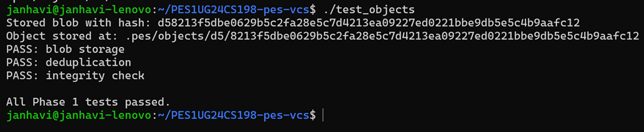
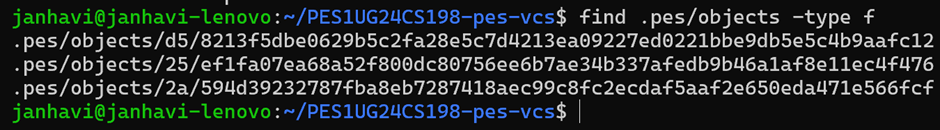
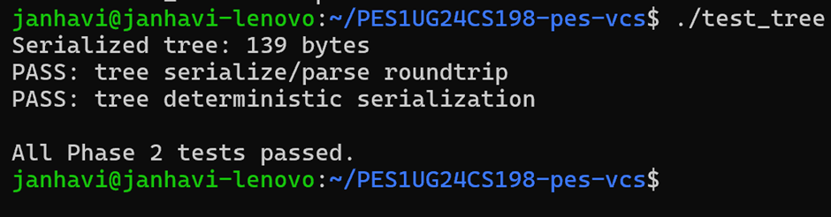
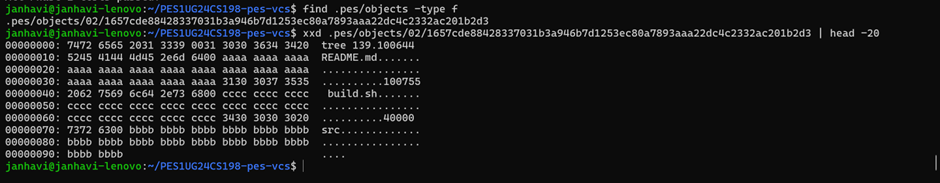

## Phase 1: Object Storage Foundation

**What was Implemented**
object_write and object_read in object.c.

object_write prepends a type header of the form "blob 16\0" to the raw data, computes the SHA-256 of the combined header and data, checks for deduplication (if the hash already exists on disk, it returns early), creates the shard directory using the first two hex characters of the hash, writes the full object to a temporary file in that directory, calls fsync() on the file descriptor, atomically renames it to the final path, and then fsync()s the shard directory to persist the rename. Finally it writes the computed hash into *id_out.

object_read reconstructs the object's file path from the hash using object_path(), reads the entire file into memory, recomputes the SHA-256 of what was read and compares it byte-for-byte against the hash in the filename — if they differ, it returns -1 immediately (corruption detected). Otherwise it finds the null byte separating the header from the data, parses the type string ("blob", "tree", "commit"), allocates a buffer, copies the data portion into it, and returns the type, pointer, and length to the caller.

**📸 Screenshot 1A:** Output of `./test_objects` showing all tests passing.



**📸 Screenshot 1B:** `find .pes/objects -type f` showing the sharded directory structure.



---

## Phase 2: Tree Objects

**What was Implemented**
tree_from_index in tree.c.

The function loads the current index, sorts all entries by path using qsort, then calls a recursive helper write_tree_level. This helper receives a slice of the sorted entries and a path prefix. For each entry, it checks whether the relative path (after stripping the prefix) contains a /. If it does not, the entry is a plain file at the current directory level and is added directly to the current Tree struct. If it does contain a /, the function extracts the directory name, computes the sub-prefix, advances through all entries sharing that sub-prefix, and recurses to build the subtree. The subtree is written to the object store via tree_serialize + object_write(OBJ_TREE, ...), and the current level gets a directory entry (mode 040000) pointing to the returned subtree hash. After all entries are processed at the current level, the current tree is serialized and written, and its hash is returned.

Because tree_serialize internally sorts entries by name using qsort, the serialization is deterministic regardless of insertion order — identical directory contents always produce the same tree hash, which enables Git-style deduplication across commits.

**📸 Screenshot 2A:** Output of `./test_tree` showing all tests passing.



**📸 Screenshot 2B:** Pick a tree object from `find .pes/objects -type f` and run `xxd .pes/objects/XX/YYY... | head -20` to show the raw binary format.


---

## Phase 3: The Index (Staging Area)

**Filesystem Concepts:** File format design, atomic writes, change detection using metadata

**Files:** `index.h` (read), `index.c` (implement all TODO functions)

### What to Implement

Open `index.c`. Three functions are marked `// TODO`:

1. **`index_load`** — Reads the text-based `.pes/index` file into an `Index` struct.
   - If the file doesn't exist, initializes an empty index (this is not an error)
   - Parses each line: `<mode> <hash-hex> <mtime> <size> <path>`

2. **`index_save`** — Writes the index atomically (temp file + rename).
   - Sorts entries by path before writing
   - Uses `fsync()` on the temp file before renaming

3. **`index_add`** — Stages a file: reads it, writes blob to object store, updates index entry.
   - Use the provided `index_find` to check for an existing entry

`index_find` , `index_status` and `index_remove` are already implemented for you — read them to understand the index data structure before starting.

#### Expected Output of `pes status`

```
Staged changes:
  staged:     hello.txt
  staged:     src/main.c

Unstaged changes:
  modified:   README.md
  deleted:    old_file.txt

Untracked files:
  untracked:  notes.txt
```

If a section has no entries, print the header followed by `(nothing to show)`.

### Testing

```bash
make pes
./pes init
echo "hello" > file1.txt
echo "world" > file2.txt
./pes add file1.txt file2.txt
./pes status
cat .pes/index    # Human-readable text format
```

**📸 Screenshot 3A:** Run `./pes init`, `./pes add file1.txt file2.txt`, `./pes status` — show the output.

**📸 Screenshot 3B:** `cat .pes/index` showing the text-format index with your entries.

---

## Phase 4: Commits and History

**Filesystem Concepts:** Linked structures on disk, reference files, atomic pointer updates

**Files:** `commit.h` (read), `commit.c` (implement all TODO functions)

### What to Implement

Open `commit.c`. One function is marked `// TODO`:

1. **`commit_create`** — The main commit function:
   - Builds a tree from the index using `tree_from_index()` (**not** from the working directory — commits snapshot the staged state)
   - Reads current HEAD as the parent (may not exist for first commit)
   - Gets the author string from `pes_author()` (defined in `pes.h`)
   - Writes the commit object, then updates HEAD

`commit_parse`, `commit_serialize`, `commit_walk`, `head_read`, and `head_update` are already implemented — read them to understand the commit format before writing `commit_create`.

The commit text format is specified in the comment at the top of `commit.c`.

### Testing

```bash
./pes init
echo "Hello" > hello.txt
./pes add hello.txt
./pes commit -m "Initial commit"

echo "World" >> hello.txt
./pes add hello.txt
./pes commit -m "Add world"

echo "Goodbye" > bye.txt
./pes add bye.txt
./pes commit -m "Add farewell"

./pes log
```

You can also run the full integration test:

```bash
make test-integration
```

**📸 Screenshot 4A:** Output of `./pes log` showing three commits with hashes, authors, timestamps, and messages.

**📸 Screenshot 4B:** `find .pes -type f | sort` showing object store growth after three commits.

**📸 Screenshot 4C:** `cat .pes/refs/heads/main` and `cat .pes/HEAD` showing the reference chain.

---

## Phase 5 & 6: Analysis-Only Questions

The following questions cover filesystem concepts beyond the implementation scope of this lab. Answer them in writing — no code required.

### Branching and Checkout

**Q5.1:** A branch in Git is just a file in `.git/refs/heads/` containing a commit hash. Creating a branch is creating a file. Given this, how would you implement `pes checkout <branch>` — what files need to change in `.pes/`, and what must happen to the working directory? What makes this operation complex?

**Q5.2:** When switching branches, the working directory must be updated to match the target branch's tree. If the user has uncommitted changes to a tracked file, and that file differs between branches, checkout must refuse. Describe how you would detect this "dirty working directory" conflict using only the index and the object store.

**Q5.3:** "Detached HEAD" means HEAD contains a commit hash directly instead of a branch reference. What happens if you make commits in this state? How could a user recover those commits?

### Garbage Collection and Space Reclamation

**Q6.1:** Over time, the object store accumulates unreachable objects — blobs, trees, or commits that no branch points to (directly or transitively). Describe an algorithm to find and delete these objects. What data structure would you use to track "reachable" hashes efficiently? For a repository with 100,000 commits and 50 branches, estimate how many objects you'd need to visit.

**Q6.2:** Why is it dangerous to run garbage collection concurrently with a commit operation? Describe a race condition where GC could delete an object that a concurrent commit is about to reference. How does Git's real GC avoid this?

---

## Submission Checklist

### Screenshots Required

| Phase | ID  | What to Capture                                                 |
| ----- | --- | --------------------------------------------------------------- |
| 1     | 1A  | `./test_objects` output showing all tests passing               |
| 1     | 1B  | `find .pes/objects -type f` showing sharded directory structure |
| 2     | 2A  | `./test_tree` output showing all tests passing                  |
| 2     | 2B  | `xxd` of a raw tree object (first 20 lines)                    |
| 3     | 3A  | `pes init` → `pes add` → `pes status` sequence                 |
| 3     | 3B  | `cat .pes/index` showing the text-format index                  |
| 4     | 4A  | `pes log` output with three commits                            |
| 4     | 4B  | `find .pes -type f \| sort` showing object growth              |
| 4     | 4C  | `cat .pes/refs/heads/main` and `cat .pes/HEAD`                 |
| Final | --  | Full integration test (`make test-integration`)                 |

### Code Files Required (5 files)

| File           | Description                              |
| -------------- | ---------------------------------------- |
| `object.c`     | Object store implementation              |
| `tree.c`       | Tree serialization and construction      |
| `index.c`      | Staging area implementation              |
| `commit.c`     | Commit creation and history walking      |

### Analysis Questions (written answers)

| Section                   | Questions        |
| ------------------------- | ---------------- |
| Branching (analysis-only) | Q5.1, Q5.2, Q5.3 |
| GC (analysis-only)        | Q6.1, Q6.2       |

-----------

## Submission Requirements

**1. GitHub Repository**
* You must submit the link to your GitHub repository via the official submission link (which will be shared by your respective faculty).
* The repository must strictly maintain the directory structure you built throughout this lab.
* Ensure your github repository is made `public`

**2. Lab Report**
* Your report, containing all required **screenshots** and answers to the **analysis questions**, must be placed at the **root** of your repository directory.
* The report must be submitted as either a PDF (`report.pdf`) or a Markdown file (`README.md`).

**3. Commit History (Graded Requirement)**
* **Minimum Requirement:** You must have a minimum of **5 commits per phase** with appropriate commit messages. Submitting fewer than 5 commits for any given phase will result in a deduction of marks.
* **Best Practices:** We highly prefer more than 5 detailed commits per phase. Granular commits that clearly show the delta in code block changes allow us to verify your step-by-step understanding of the concepts and prevent penalties <3

---

## Further Reading

- **Git Internals** (Pro Git book): https://git-scm.com/book/en/v2/Git-Internals-Plumbing-and-Porcelain
- **Git from the inside out**: https://codewords.recurse.com/issues/two/git-from-the-inside-out
- **The Git Parable**: https://tom.preston-werner.com/2009/05/19/the-git-parable.html
